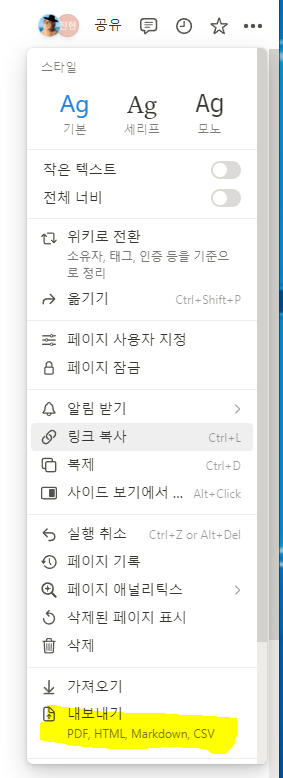
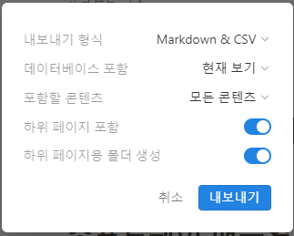
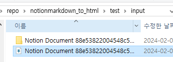

# Notion Markdown Converter

## 목적

Notion으로 뽑은 Markdown과 CSS 파일을 아래와 같이 변환합니다.

1. Github에 바로 업로드 가능한 형태로 변형된 Markdown 디렉토리
2. html 파일들이 있는 디렉토리
3. pdf 파일들이 있는 디렉토리

## 사용법

### Windows 사용법

1. 파이썬 가상환경 만들기
```bash
python -m venv venv
```

2. 가상환경 활성화 하기
```bash
source venv/Scripts/activate
``` 

3. 종속성 설치하기
```bash
pip install -r requirements.txt
```

4. 페이지를 추출하기 위해 왼쪽 상단의 '...'를 누른 뒤, 내보내기를 누르기  


5. 하위 페이지를 포함하고자 할 때 `하위 페이지 포함`, `하위 페이지용 폴더` 를 선택하여 확인 누르기.  


6. test/input 폴더를 만들고 노션 페이지 압축 폴더를 풀기  
   

7. 실행하기
```bash
python main.py
```

8. 가상환경 빠져나오기
```bash
deactivate
```

## 종속성 추출

1. 개발 중 새로운 종속성이 생겼을 때, 아래의 명령어로 추출한다.

```bash
pip freeze > requirements.txt
```

# 주의사항

1. 노션 제목에 쉼표나 줄바꿈(Shift + Enter)를 넣지 마세요.